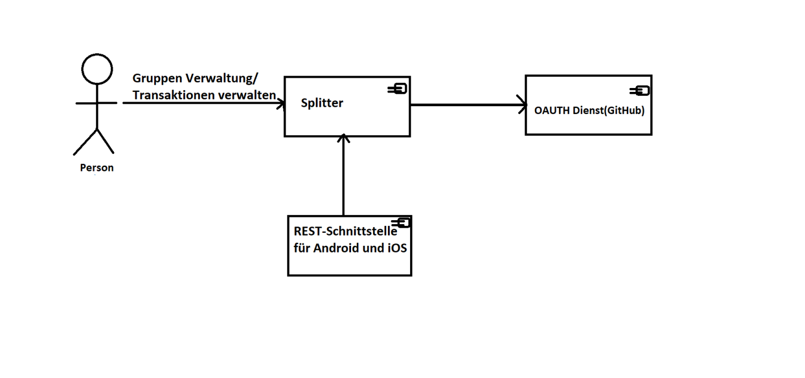

[[section-system-scope-and-context]]
== 3.Kontextabgrenzung

[role="arc42help"]

****
.Context Abgrenzung Diagramm

Personen können sich nur mit dem Github an der Webanwendung anmelden (abmelden) und neue Gruppen
erstellen sowie auch anderen Personen hinzufügen.
Personen können Transaktionen eintragen und jederzeit Überblick auf die Ausgaben
als auch die notwendigen Ausgleich-Transaktionen haben.
Jede beteiligte Person darf seine Gruppe schließen.
Wenn die Gruppe geschlossen wurde, darf keine Transaktionen oder Personen
mehr hinzugefügt werden.

Unsere Splitter System ist durch den Api Adapter mit einem externen System:
native Clients für Android und iOS verbunden.
